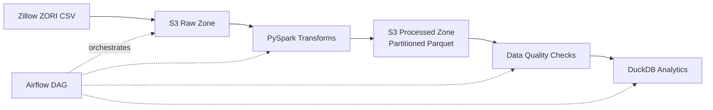

# PySpark Rental Market ETL Pipeline

Production-style ETL pipeline processing Zillow ZORI (Observed Rent Index) data with PySpark window functions, configurable data quality checks, and Airflow orchestration.

## Architecture



## Key Features

- **Window functions** — month-over-month rent change via `lag()`, state-level ranking via `rank()`
- **Data quality framework** — configurable null %, row count, range, and uniqueness checks with warn/fail severity
- **Partitioned Parquet** — output partitioned by `(StateName, year)` with Snappy compression
- **Airflow orchestration** — `@weekly` DAG using TaskFlow API: download → transform → DQ → DuckDB load
- **CI/CD** — parallel GitHub Actions for lint (ruff) and test (pytest + PySpark)

## Tech Stack

Python 3.10+ · PySpark 3.5 · Apache Airflow 2.x · AWS S3 (boto3) · DuckDB · pytest · ruff · GitHub Actions

## Quick Start

```bash
git clone https://github.com/jairajsaraf/rentals-data-pipeline.git
cd rentals-data-pipeline
python -m venv .venv && source .venv/bin/activate
pip install -r requirements.txt

# Run transforms locally
make run-local

# Run tests
make test

# Lint
make lint
```

> **Requires:** Java 11+ (PySpark dependency)

## Pipeline Details

### Transforms (`jobs/transform.py`)

| Step | Function | Description |
|------|----------|-------------|
| 1 | `enforce_schema` | Select columns, cast types (dynamic date column detection) |
| 2 | `unpivot_monthly` | Wide → long format via `stack()` |
| 3 | `clean_nulls` | Drop null `median_rent` rows |
| 4 | `deduplicate` | Remove dupes on `(RegionID, month)` |
| 5 | `add_mom_change` | MoM % rent change — `lag()` over `partitionBy(RegionID)` |
| 6 | `add_state_rank` | Rent rank — `rank()` over `partitionBy(StateName, month)` |

### Data Quality (`jobs/data_quality.py`)

Configurable checks driven by `config/pipeline.yaml`:

- **Null %** — `median_rent` null fraction <= 10%
- **Row count** — minimum 100 rows
- **Range** — rent values in [0, 50000]
- **Uniqueness** — no duplicates on `(RegionID, month)`

Checks use a `DataQualityCheck` dataclass with `warn`/`fail` severity. Failed checks raise `DataQualityError`.

### Partitioning

Output Parquet is partitioned by `StateName` and `year` (extracted from `month`), enabling efficient queries by geography and time.

## Project Structure

```
├── dags/
│   └── rental_pipeline_dag.py    # Airflow DAG (TaskFlow API)
├── jobs/
│   ├── transform.py              # PySpark transforms (pure functions)
│   ├── data_quality.py           # DQ assertion framework
│   └── io_utils.py               # CSV/Parquet I/O + config loader
├── tests/
│   ├── conftest.py               # SparkSession + sample data fixtures
│   ├── test_transform.py         # 6 transform tests
│   └── test_data_quality.py      # 10 DQ tests
├── config/
│   └── pipeline.yaml             # S3 paths, partition keys, DQ thresholds
├── .github/workflows/ci.yml      # Parallel lint + test CI
├── Makefile                       # test, lint, run-local, clean
└── requirements.txt               # Pinned dependencies
```
